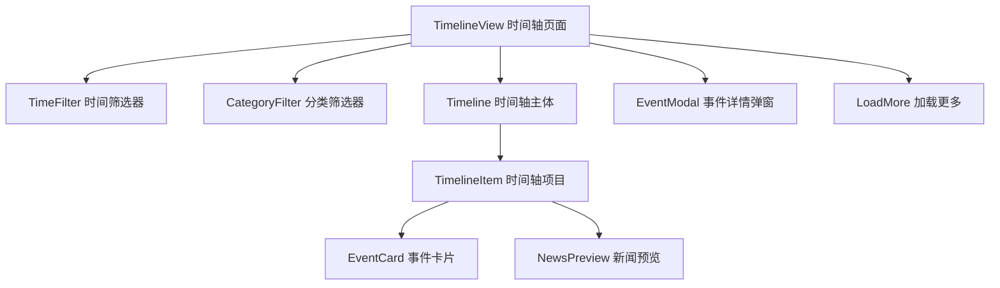

# TechSum 科技新闻聚合网站 - 项目实施方案

## 🎯 项目概览

**项目名称**: TechSum 科技新闻聚合网站  
**核心目标**: 完全复刻 techsum.ai 现有功能，并添加创新的热点新闻Timeline功能  
**技术栈**: Vue 3 + TypeScript + Vite + Pinia + Vue Router

## 📋 详细实现计划

### 阶段一：项目架构设计与基础配置

#### 1.1 技术栈确认
- **前端框架**: Vue 3 + TypeScript + Vite
- **状态管理**: Pinia
- **路由**: Vue Router 4
- **UI组件**: 自定义组件 + 可能集成 Element Plus 或 Ant Design Vue
- **样式**: CSS3 + 响应式设计
- **HTTP客户端**: Axios
- **数据来源**: 初期模拟数据，预留API接口

#### 1.2 项目结构重构
```
src/
├── components/           # 公共组件
│   ├── common/          # 通用组件
│   │   ├── Header.vue   # 网站头部导航
│   │   ├── Footer.vue   # 网站底部
│   │   ├── Loading.vue  # 加载动画
│   │   └── SearchBar.vue # 搜索组件
│   ├── news/            # 新闻相关组件
│   │   ├── NewsCard.vue     # 新闻卡片
│   │   ├── NewsList.vue     # 新闻列表
│   │   ├── NewsDetail.vue   # 新闻详情
│   │   └── CategoryFilter.vue # 分类筛选
│   └── timeline/        # Timeline组件
│       ├── Timeline.vue     # 主时间轴组件
│       ├── TimelineItem.vue # 时间轴项目
│       └── TimeFilter.vue   # 时间筛选器
├── views/               # 页面组件
│   ├── HomeView.vue         # 首页
│   ├── EventsView.vue       # 事件页面
│   ├── HighlightsView.vue   # 亮点页面
│   ├── TimelineView.vue     # Timeline页面
│   └── NewsDetailView.vue   # 新闻详情页
├── stores/              # 状态管理
│   ├── news.ts          # 新闻数据管理
│   ├── timeline.ts      # Timeline数据管理
│   └── app.ts           # 应用全局状态
├── services/            # API服务
│   ├── api.ts           # API配置
│   ├── newsService.ts   # 新闻服务
│   └── mockData.ts      # 模拟数据
├── types/               # TypeScript类型定义
│   ├── news.ts          # 新闻相关类型
│   └── timeline.ts      # Timeline相关类型
└── utils/               # 工具函数
    ├── dateUtils.ts     # 日期处理工具
    ├── formatUtils.ts   # 格式化工具
    └── constants.ts     # 常量定义
```

#### 1.3 依赖包安装计划
```bash
# UI组件库
npm install element-plus
# 或者
npm install ant-design-vue

# HTTP客户端
npm install axios

# 日期处理
npm install dayjs

# 图标库
npm install @element-plus/icons-vue
# 或者
npm install @ant-design/icons-vue

# CSS预处理器（可选）
npm install -D sass
```

### 阶段二：数据模型设计

#### 2.1 核心数据结构

```typescript
// 新闻数据结构
interface NewsItem {
  id: string
  title: string
  summary: string
  content: string
  category: string
  publishTime: Date
  author: string
  tags: string[]
  imageUrl?: string
  sourceUrl?: string
  isHot: boolean
  viewCount: number
  likes: number
}

// Timeline事件结构
interface TimelineEvent {
  id: string
  title: string
  description: string
  date: Date
  category: string
  importance: 'high' | 'medium' | 'low'
  relatedNews: string[]
  tags: string[]
  imageUrl?: string
}

// 分类定义
interface Category {
  id: string
  name: string
  slug: string
  color: string
  icon?: string
}

// 筛选条件
interface FilterOptions {
  category?: string
  dateRange?: {
    start: Date
    end: Date
  }
  tags?: string[]
  importance?: string[]
}
```

#### 2.2 模拟数据设计
- **新闻数据**: 100+ 条科技新闻
- **Timeline事件**: 50+ 个重要科技事件
- **分类数据**: AI、区块链、互联网、硬件、软件、创业等
- **标签系统**: 热门标签和相关性标签

### 阶段三：核心功能开发

#### 3.1 页面开发优先级

**优先级1 - 基础页面**
1. **首页 (HomeView)**
   - 响应式头部导航栏
   - 热门新闻轮播/焦点图
   - 分类新闻列表展示
   - 全局搜索功能
   - 侧边栏推荐内容

2. **事件页面 (EventsView)**
   - 重要科技事件时间线展示
   - 事件分类筛选功能
   - 事件详情查看模态框
   - 相关新闻推荐

3. **亮点页面 (HighlightsView)**
   - 编辑精选内容展示
   - 热门文章排行
   - 专题报道区域
   - 热门标签云

**优先级2 - 核心创新功能**
4. **Timeline页面 (TimelineView)**
   - 垂直时间轴主体布局
   - 多维度筛选器（时间、分类、重要性）
   - 事件详情展示卡片
   - 相关新闻快速预览
   - 响应式移动端适配

5. **新闻详情页 (NewsDetailView)**
   - 文章内容展示
   - 相关文章推荐
   - 社交分享功能
   - 评论系统预留

#### 3.2 组件开发计划

**通用组件**
- `Header.vue`: 导航栏，搜索，用户菜单
- `Footer.vue`: 网站信息，链接导航
- `Loading.vue`: 统一加载动画
- `SearchBar.vue`: 智能搜索组件

**新闻组件**
- `NewsCard.vue`: 新闻卡片展示
- `NewsList.vue`: 新闻列表容器
- `CategoryFilter.vue`: 分类筛选器

**Timeline组件**
- `Timeline.vue`: 时间轴主容器
- `TimelineItem.vue`: 单个时间轴项目
- `TimeFilter.vue`: 时间范围筛选器
- `EventModal.vue`: 事件详情弹窗

### 阶段四：Timeline功能详细设计

#### 4.1 Timeline组件架构



#### 4.2 Timeline交互设计

**筛选功能**
- **时间筛选**: 今天、本周、本月、本季度、本年、自定义时间段
- **分类筛选**: AI、区块链、互联网、硬件、软件、创业投资等
- **重要性筛选**: 高、中、低重要性事件
- **标签筛选**: 多选标签过滤

**展示方式**
- **桌面端**: 左侧时间轴线 + 右侧事件卡片
- **平板端**: 居中时间轴 + 两侧交替事件卡片
- **移动端**: 垂直堆叠布局，简化时间轴

**交互效果**
- **悬停效果**: 卡片阴影变化，显示更多信息
- **点击详情**: 模态框展示完整事件信息
- **平滑滚动**: 时间轴滚动定位功能
- **懒加载**: 滚动到底部自动加载更多

#### 4.3 Timeline核心算法

```typescript
// 时间轴数据处理核心逻辑
const processTimelineData = (
  events: TimelineEvent[], 
  filter: FilterOptions
): ProcessedTimelineEvent[] => {
  return events
    .filter(event => matchesTimeRange(event.date, filter.dateRange))
    .filter(event => matchesCategory(event.category, filter.category))
    .filter(event => matchesImportance(event.importance, filter.importance))
    .filter(event => matchesTags(event.tags, filter.tags))
    .sort((a, b) => b.date.getTime() - a.date.getTime())
    .map(event => ({
      ...event,
      relativeTime: formatRelativeTime(event.date),
      formattedDate: formatDate(event.date),
      position: calculateTimelinePosition(event.date)
    }))
}

// 时间轴位置计算
const calculateTimelinePosition = (date: Date): number => {
  const now = new Date()
  const diffDays = Math.floor((now.getTime() - date.getTime()) / (1000 * 60 * 60 * 24))
  return Math.min(diffDays * 10, 1000) // 限制最大位置
}
```

### 阶段五：UI/UX设计规范

#### 5.1 设计风格定义
- **主色调**: 科技蓝 (#1890ff) + 深空灰 (#001529)
- **辅助色**: 成功绿 (#52c41a)、警告橙 (#fa8c16)、错误红 (#f5222d)
- **字体系统**: 
  - 中文: PingFang SC, Microsoft YaHei, sans-serif
  - 英文: -apple-system, BlinkMacSystemFont, Segoe UI, Roboto
- **圆角**: 统一使用 6px 圆角
- **阴影**: 多层次阴影系统，增强层次感

#### 5.2 响应式断点设计
```css
/* 响应式断点定义 */
$breakpoints: (
  xs: 0,      // 超小屏幕
  sm: 576px,  // 小屏幕
  md: 768px,  // 中等屏幕
  lg: 992px,  // 大屏幕
  xl: 1200px, // 超大屏幕
  xxl: 1600px // 超超大屏幕
);

/* Timeline响应式布局 */
.timeline-container {
  display: grid;
  grid-template-columns: 1fr;
  gap: 1rem;
  padding: 1rem;
}

@media (min-width: 768px) {
  .timeline-container {
    grid-template-columns: 250px 1fr;
    gap: 2rem;
    padding: 2rem;
  }
}

@media (min-width: 1200px) {
  .timeline-container {
    grid-template-columns: 300px 1fr 200px;
    max-width: 1400px;
    margin: 0 auto;
  }
}
```

#### 5.3 组件设计规范
- **卡片组件**: 统一的卡片样式，包含标题、摘要、标签、时间等
- **按钮系统**: 主要按钮、次要按钮、文本按钮等不同层级
- **表单组件**: 统一的输入框、选择器、日期选择器样式
- **导航组件**: 面包屑、标签页、侧边导航等

### 阶段六：状态管理设计

#### 6.1 Pinia Store 结构

```typescript
// stores/news.ts - 新闻数据管理
export const useNewsStore = defineStore('news', {
  state: () => ({
    newsList: [] as NewsItem[],
    categories: [] as Category[],
    currentNews: null as NewsItem | null,
    loading: false,
    searchKeyword: '',
    currentCategory: 'all'
  }),
  
  getters: {
    filteredNews: (state) => {
      // 根据分类和搜索关键词过滤新闻
    },
    hotNews: (state) => {
      // 获取热门新闻
    }
  },
  
  actions: {
    async fetchNews() {
      // 获取新闻数据
    },
    async searchNews(keyword: string) {
      // 搜索新闻
    }
  }
})

// stores/timeline.ts - Timeline数据管理
export const useTimelineStore = defineStore('timeline', {
  state: () => ({
    events: [] as TimelineEvent[],
    filteredEvents: [] as TimelineEvent[],
    filter: {
      dateRange: null,
      category: 'all',
      importance: [],
      tags: []
    } as FilterOptions,
    loading: false
  }),
  
  actions: {
    async fetchTimelineEvents() {
      // 获取时间轴事件
    },
    updateFilter(newFilter: Partial<FilterOptions>) {
      // 更新筛选条件
    },
    applyFilter() {
      // 应用筛选条件
    }
  }
})
```

### 阶段七：API服务设计

#### 7.1 API抽象层设计

```typescript
// services/api.ts - API基础配置
import axios from 'axios'

const api = axios.create({
  baseURL: process.env.VUE_APP_API_BASE_URL || '/api',
  timeout: 10000,
  headers: {
    'Content-Type': 'application/json'
  }
})

// 请求拦截器
api.interceptors.request.use(